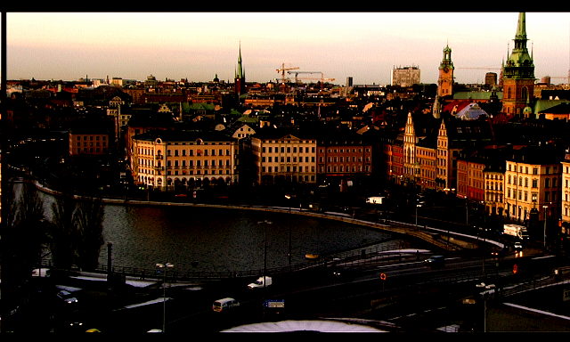
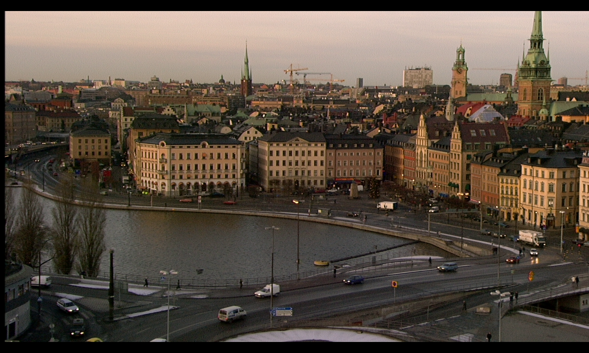
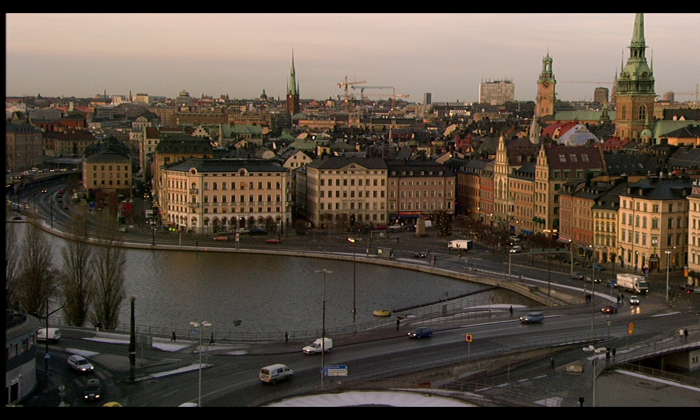
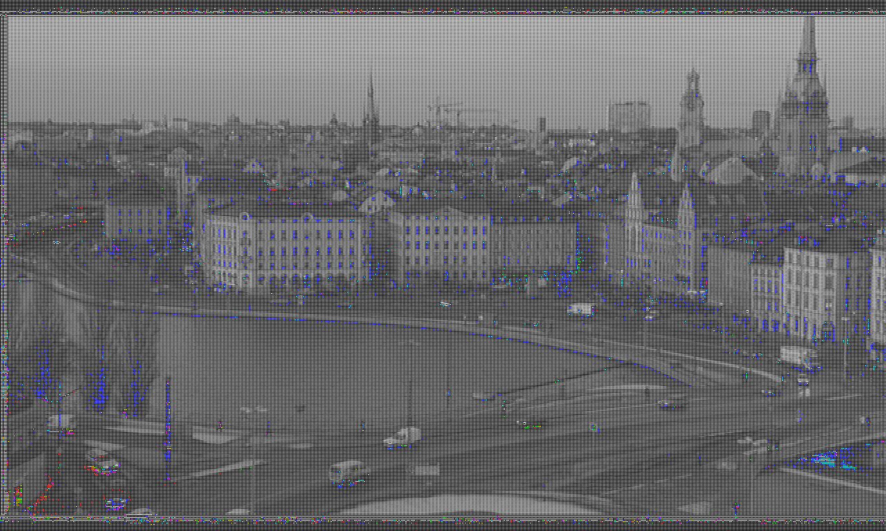
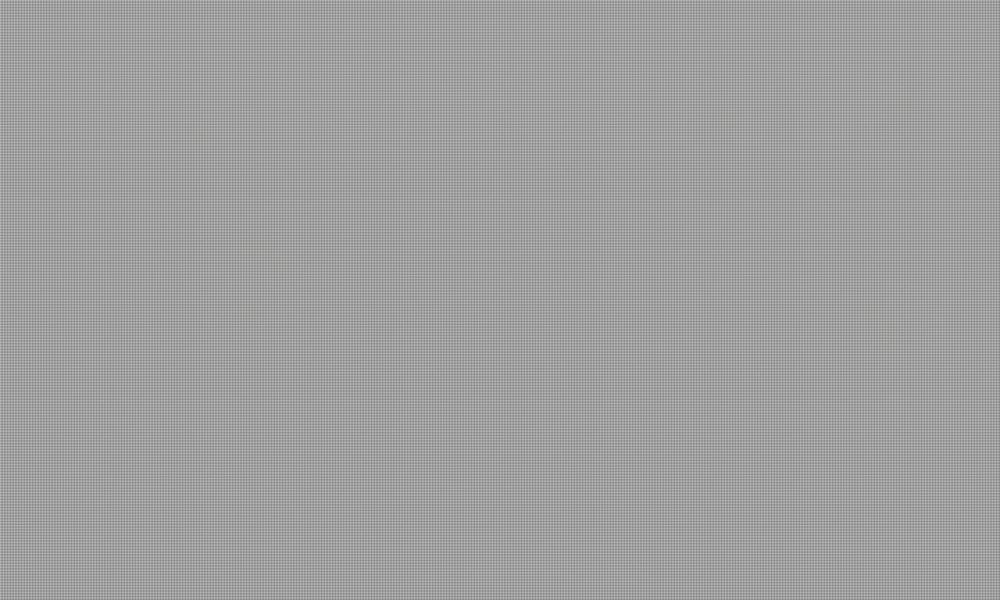

# Visual evaluation of the effects of quantization 

El script implementado (*quantization_image.py*) se encarga de cuantificar una imagen con el paso de cuantificación
pasado por parámetro.

El script se encarga de dividir la imagen de entrada entre el paso (frame/step) y posteriormente de realizar el proceso contrario (frame*step). Para que se pueda visualizar los efectos de la cuantificación los resultados de estas operaciones han sido casteadas como número enteros, variando la alteración de la imagén resultante dependiendo de la variable de paso.

## Ejemplo de uso:

 *python3 quantization_image.py -i /tmp/inputImage.png -s 24 -o /tmp/inputImage.png*

* **python3** Es la versión de python utilizada.
* **-i** Es la ruta de la imagen a cuantificar.
* **-s** Es el valor del paso de cuantificación.
* **-o** Es la ruta de salida de la imagen cuantificada.

## Ejecución del experimento

La ejecución de comandos se ha realizado desde la carpeta src y su secuencia ha sido la siguiente:

1. Se copian las secuencias de imágenes sobre las que se trabajara a */tmp*

  -  yes | cp ../sequences/stockholm/*.png /tmp  
 
2. Se realiza la transformada directa MDWT:  

  - python3 -O MDWT.py -p /tmp/  
 
3. Se realiza la transformada directa MCDWT:  

  - python3 -O MCDWT.py -p /tmp/  
 
4. Se eliminan las imágenes de la secuencia original 

  - rm /tmp/00?.png

5. Se cuantifican las subbandas:

**Nota:** Al tener las imágenes un rango dinámico diferente al convencional se debe transformar la subbanda al rango convencional, realizar la cuantificación de la imágen y posteriormente devolverla a su rango dinámico original.

  - En la primera prueba solo las H:

    - for i in /tmp/H????.png; do python3 ../tools/substract_offset.py -i $i -o $i; python3 ../tools/quantization_image.py -i $i -s 2 -o $i;python3 ../tools/add_offset.py -i $i -o $i; done;
    
| | |
|:--:| :--:| 
| *Subbanda HL cuantificada (Tras normalización)*|*Subbanda HL cuantificada (Sin normalización)*|

  - En la segunda prueba incluimos las L:

    - for i in /tmp/L????.png; do python3 ../tools/substract_offset.py -i $i -o $i; python3 ../tools/quantization_image.py -i $i -s 2 -o $i;python3 ../tools/add_offset.py -i $i -o $i; done;
    
| | |
|:--:| :--:| 
| *Subbanda LL cuantificada (Tras normalización)*|*Subbanda LL cuantificada (Sin normalización)*|
   
 6.  Se realiza la transformada inversa MCDWT:  

  - python3 -O MCDWT.py -b -p /tmp/  
 
 7. Se realiza la transformada inversa MDWT:  

  - python3 -O MDWT.py -b -p /tmp/  
 
8. Se visualiza la reconstrucción:  

  - for i in /tmp/???.png; do python3 ../tools/substract_offset.py -i $i -o $i.png; done; animate /tmp/???.png.png
  
  ## Conlusiones

En el caso de cuantificar únicamente las subbandas H la imagen es bastante próxima a la original, esto es debido a que 
la mayoria de la información de la imagen se encuentra en la subbanda LL que no se ha cuantificado.

| | |
|:--:| :--:| 
| *Imágen original*|*Imágen reconstruida trás cuantificar subbandas H (Tras normalizarlas)*|

En el segundo caso la imagen es distinguible, pero se aprecia que hay diferencias respecto a la imágen original. El modificar los valores de la subbanda LL además puede provocar que fallen las predicciones debido a que esta contiene la información de movimiento.

| | |
|:--:| :--:| 
| *Imágen original*|*Imágen reconstruida trás cuantificar todas las subbandas (tras normalizarlas)*|

Si no se trata el rango dinámico de las imágenes cuando se cuantifica al realizar la reconstrucción se obtienen los siguietnes resultados.

| | ||
|:--:| :--:| :--:| 
| *Imágen original*|*Imágen reconstruida trás cuantificar subbandas H (Sin normalizarlas)*|*Imágen reconstruida trás cuantificar todas las subbandas (Sin normalizarlas)*|

